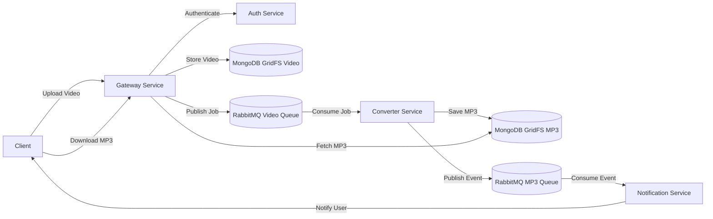

## 🎬 Video to MP3 Conversion App (Backend)

**A production-oriented, microservices-based backend system** that converts uploaded video files into MP3 audio asynchronously. Transform videos into music effortlessely.
Designed with **_scalability, reliability, and cloud-native deployment_** in mind. Built with **_docker, kubernetes, python, Flask, rabbitMQ_**

---

### 📑Table of Contents
- Overview
- Application Architecture & Flow
- Features
- Tech Stack
- Project Structure
- API & Processing Flow
- Quick Start
- Project setup
- Configuration
- Deployment
- Engineering Highlights
- License
---

### 📘Overview
This project implements the **backend services** for a Video-to-MP3 conversion application. 
It follows a **decoupled microservices architecture**, where video processing is handled asynchronously using a message queue to ensure non-blocking user requests and high scalability.

---

## 🧠Application Architecture & Flow


**Key Ideas**
- API Gateway pattern
- Event-driven processing
- Stateless services
- Horizontal scalability

---

### ✨Features

- Secure user authentication using JWT
- Asynchronous video-to-audio conversion
- Video & audio storage using MongoDB GridFS
- Message-driven processing via RabbitMQ
- Clean separation of responsibilities across services
- Kubernetes-ready manifests for deployment

---

### 🧰Tech Stack

| Category | Technology |
|--------|------------|
| Language | Python |
| API Framework | Flask |
| Messaging | RabbitMQ |
| Media Processing | FFmpeg |
| Authentication | JWT |
| Databases | MySQL, MongoDB (GridFS) |
| Containers | Docker |
| Orchestration | Kubernetes |

---

### 📁Project Structure
```
├── LICENSE
└── python
    └── src
        ├── auth
        │   ├── Dockerfile
        │   ├── __init__.py
        │   ├── init.sql
        │   ├── manifests
        │   │   ├── auth-deploy.yaml
        │   │   ├── configmap.yaml
        │   │   ├── mysql-deploy.yaml
        │   │   ├── mysql-initdb-configmap.yaml
        │   │   ├── mysql-pvc.yaml
        │   │   ├── mysql-service.yaml
        │   │   ├── secret.yaml
        │   │   └── service.yaml
        │   ├── requirements.txt
        │   └── server.py
        ├── converter
        │   ├── Dockerfile
        │   ├── __init__.py
        │   ├── consumer.py
        │   ├── convert
        │   │   ├── __init__.py
        │   │   └── to_mp3.py
        │   ├── manifests
        │   │   ├── converter-configmap.yaml
        │   │   ├── converter-deploy.yaml
        │   │   └── converter-secret.yaml
        │   └── requirements.txt
        ├── gateway
        │   ├── Dockerfile
        │   ├── auth
        │   │   ├── __init__.py
        │   │   ├── __pycache__
        │   │   └── validate.py
        │   ├── auth_svc
        │   │   ├── __init__.py
        │   │   ├── __pycache__
        │   │   └── access.py
        │   ├── manifests
        │   │   ├── configmap.yaml
        │   │   ├── gateway-deploy.yaml
        │   │   ├── gateway-service.yaml
        │   │   ├── ingress.yaml
        │   │   └── secret.yaml
        │   ├── requirements.txt
        │   ├── server.py
        │   └── storage
        │       ├── __init__.py
        │       ├── __pycache__
        │       └── util.py
        ├── mongo
        │   └── manifests
        │       ├── mongo-deploy.yaml
        │       ├── mongo-pvc.yaml
        │       └── mongo-service.yaml
        ├── notification
        │   ├── Dockerfile
        │   ├── consumer.py
        │   ├── manifests
        │   │   ├── notification-configmap.yaml
        │   │   ├── notification-deploy.yaml
        │   │   └── notification-secret.yaml
        │   ├── requirements.txt
        │   └── send
        │       ├── __init__.py
        │       └── email.py
        └── rabbit
            └── manifests
                ├── rabbit-configmap.yaml
                ├── rabbit-ingress.yaml
                ├── rabbit-pvc.yaml
                ├── rabbit-secret.yaml
                ├── rabbit-service.yaml
                └── rabbit-statefulset.yaml
```


---

### 🔄API & Processing Flow

1. Client uploads a video via Gateway upload API
2. Gateway authenticates the user 
3. Gateway stores video in MongoDB GridFS
4. Gateway publishes conversion task to RabbitMQ video queue
5. Converter service consumes the message from video queue
6. Converter service extracts MP3 from video and save the file to converted MP3 in MongoDB
8. Converter service publishes a notification task to RabbitMQ mp3 queue
9. Notification service consumes the message from the video queue and send notification to the user with download mp3 file id
10. The user can download the converted mp3 file using the mp3 file id via Gateway download API

---

### ⚡Quick Start

**Prerequisites**
- Python 3.9+
- Docker Desktop
- k9s
- MongoDB
- MySQL
- RabbitMQ
- Postman

### ⚙Project Setup

**git**
```
- git clone https://github.com/nitinalexvaidyan/video_to_mp3_conversion_app.git
```

**Docker desktop**
```
- docker build -t nitinalexvaidyan/_service_name_:latest .
- docker push nitinalexvaidyan/_service_name_:latest
```

**Kubernetes service**
```
- kubectl rollout restart deployment _service_name_
- kubectl rollout status deployment _service_name_
- kubectl logs deployment/_service_name_
- kubectl describe pod __podid_
- kubectl get pods
- kubectl get nodes
- kubectl get services
- kubectl cluster-info
- kubectl config get-contexts
- kubectl get svc _service_name_
- kubectl get endpoints _service_name_
- kubectl apply -f /.manifests
- kubectl delete -f ./manifests
- k9s for kubernetes dashboard
```

### 🔐Configuration
Environment variables are managed via:
**.env files**
Example:
```
- RABBITMQ_HOST
- MONGO_URI
- MYSQL_HOST
- JWT_SECRET
```

or

**Kubernetes ConfigMaps & Secrets when using docker desktop**


### ☸️Deployment
The project includes Kubernetes manifests for
- Individual service deployments
- ConfigMaps for environment variables
- Secrets for credentials
- Designed for cloud platforms such as AWS, GCP, or Azure.

### 🧪Engineering Highlights
- Event-driven architecture
- Non-blocking processing
- Loose coupling between services
- Production-ready deployment structure
- Clear separation of concerns
- Designed with observability & scaling in mind
- This project demonstrates real-world backend system design, not just CRUD APIs💡


### 📄License
- This project is licensed under the Apache 2.0 License.


